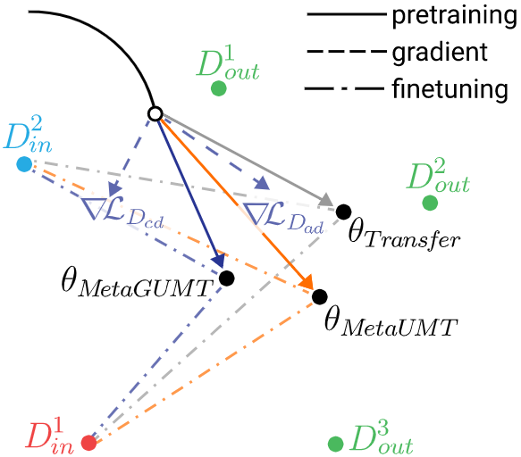

# emnlpsumbssion_code_instructions


# Meta-Learning for Low-Resource Unsupervised Neural MachineTranslation
<p align="center">
  
</p>
We have proposed two novel algorithms, called MetaUMT and MetaGUMT, to handle low-resource unsupervised neural machine translation (UNMT).

### Dependencies
Currently, our implementation for UNMT is based on [XLM](https://github.com/facebookresearch/XLM). The depencies are as follows:
- Python 3
- NumPy
- PyTorch (version  0.4.1.post2)
- fastBPE (for BPE codes)
- Moses (for tokenization)

### Data
https://www.dropbox.com/s/cxd6eavbakk4qmb/data.tar.gz?dl=0

### Initializing the model using XLM
```
python train.py                                      
--exp_name mlm_en_de                              
--data_path ./data/processed/domains/                  
--lgs 'en-de'                                        
--mlm_steps: 'en,de'                                                          
--emb_dim 1024                                       
--n_layers 6                                         
--n_heads 8                                          
--dropout 0.1                                        
--attention_dropout 0.1                              
--gelu_activation true                               
--batch_size: 32
--bptt: 256
--optimizer: adam_inverse_sqrt,lr=0.0001,warmup_updates=20000,beta1=0.9,beta2=0.999,weight_decay=0.01,eps=0.000001 
--epoch_size: 200000                                  
--validation_metrics: _valid_mlm_pp                                      
--stopping_criterion: _valid_mlm_ppl,10                                         
```

### Pretraining the model using MetaUMT
```
python train_1.py                                      
--exp_name MetaUMT
--reload_model ./best-valid_mlm_ppl.pth,./best-valid_mlm_ppl.pth
--data_path ./data/processed/domains/                  
--lgs 'en-de'                                        
--ae_steps: 'en,de'
--bt_steps: 'en-de-en,de-en-de'
--word_shuffle: 3                                             
--word_dropout: 0.1                                            
--word_blank: 0.1                                              
--lambda_ae: '0:1,100000:0.1,300000:0'                         
--encoder_only: false                                         
--emb_dim: 1024                                                
--n_layers: 6                                                  
--n_heads: 8                                                   
--dropout: 0.1                                                
--attention_dropout: 0.1                                       
--gelu_activation: true                                        
--tokens_per_batch: 1120                                        
--batch_size: 32                                               
--bptt: 256                                                    
--valid_optimizer: adam_inverse_sqrt,beta1=0.9,beta2=0.98,lr=0.0001
--optimizer: adam,lr=0.0001             
--epoch_size: 600000                                           
--eval_bleu: true                                              
--stopping_criterion: 'valid_en_de_de_en_mt_bleu,10'          
--validation_metrics: 'valid_en_de_de_en_mt_bleu'                   
--meta_transfer: False
--meta_source: 'Subtitles-Law-Europarl-IT-EUbookshop-GlobalVoices'
--meta_target: 'Medical'
--model_split: False                                        
```

### Pretraining the model using MetGUMT
```
python train_6.py                                      
--exp_name MetaGUMT
--reload_model ./best-valid_mlm_ppl.pth,./best-valid_mlm_ppl.pth
--data_path ./data/processed/domains/                  
--lgs 'en-de'                                        
--ae_steps: 'en,de'
--bt_steps: 'en-de-en,de-en-de'
--word_shuffle: 3                                             
--word_dropout: 0.1                                            
--word_blank: 0.1                                              
--lambda_ae: '0:1,100000:0.1,300000:0'                         
--encoder_only: false                                         
--emb_dim: 1024                                                
--n_layers: 6                                                  
--n_heads: 8                                                   
--dropout: 0.1                                                
--attention_dropout: 0.1                                       
--gelu_activation: true                                        
--tokens_per_batch: 1120                                        
--batch_size: 32                                               
--bptt: 256                                                    
--valid_optimizer: adam_inverse_sqrt,beta1=0.9,beta2=0.98,lr=0.0001
--optimizer: adam,lr=0.0001             
--epoch_size: 900000                                           
--eval_bleu: true                                              
--stopping_criterion: 'valid_en_de_de_en_mt_bleu,10'          
--validation_metrics: 'valid_en_de_de_en_mt_bleu'                   
--meta_transfer: False
--meta_source: 'Subtitles-Law-Europarl-IT-EUbookshop-GlobalVoices'
--meta_target: 'Medical'
--model_split: False
--data_split: True
--generalize: True
```

### Finetuing the model on low-resource data (~300 sentences)
```
python train.py                                      
--exp_name Finetune_MetaGUMT
--reload_model ./best-valid_en_de_de_en_mt_bleu.pth,./best-valid_en_de_de_en_mt_bleu.pth
--data_path ./data/processed/domains/Koran                  
--lgs: 'en-de'                                                
--ae_steps: 'en,de'
--bt_steps: 'en-de-en,de-en-de'
--word_shuffle: 3                                              
--word_dropout: 0.1                                            
--word_blank: 0.1                                             
--lambda_ae: '0:1,100000:0.1,300000:0'                        
--encoder_only: false                                         
--emb_dim: 1024                                                
--n_layers: 6                                                 
--n_heads: 8                                                   
--dropout: 0.1                                                
--attention_dropout: 0.1                                      
--gelu_activation: true                                       
--tokens_per_batch: 1120                                      
--batch_size: 32                                               
--bptt: 256                                                   
--optimizer: adam_inverse_sqrt,beta1=0.9,beta2=0.98,lr=0.0001  
--epoch_size: 3900                                        
--eval_bleu: true                                              
--stopping_criterion: 'valid_en_de_de_en_mt_bleu,10'           
--validation_metrics: 'valid_en_de_de_en_mt_bleu'                                         
```
